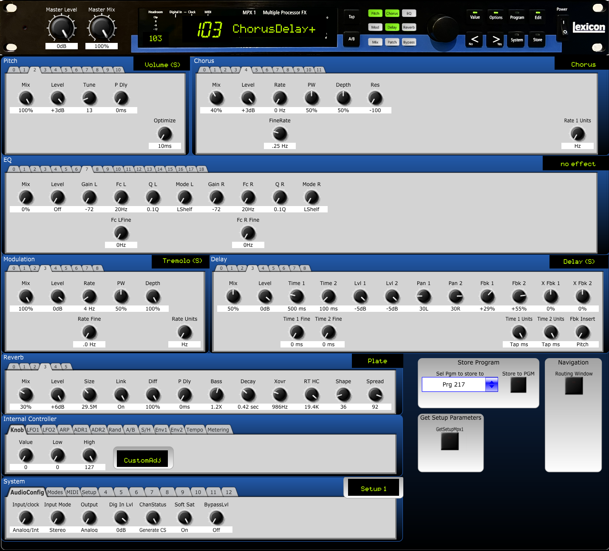

# MPX1

Lexicon MPX1 is a wonderful sounding device, but it breaks fingers if you try to edit something. So I tried to help with that. It's my second beast. Has taken some time. 
This is for Firmware Version 1.1

Use it on your own risk. I'm not responsible for anything!

## Screenshots
Please see [Screenshots](screenshots/screenshots.md)

## Known bugs
- more than I'd like ...
- While you can save to user programs, do not attempt to load an empty user program, else CTRLR will crash. The best workaround for this is to overwrite all empty programs with a dummy program. I do not have a code-based solution to this yet.
- and some more (-;

## Credits
- Made with CTRLR 5.3.201 (uses JUCE)
- The standard rotary knob is made by [Joe Beuckman](https://github.com/jbeuckm) (MPX100), many thanks for his permission.

## License
See [License](./License.md)
